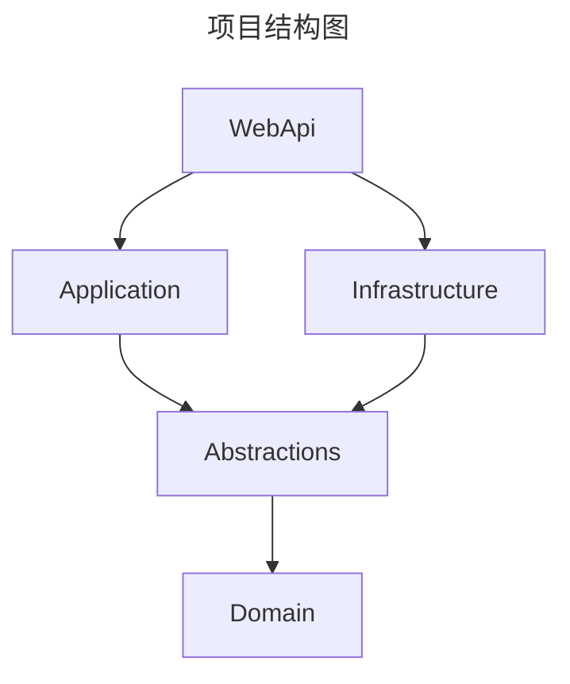
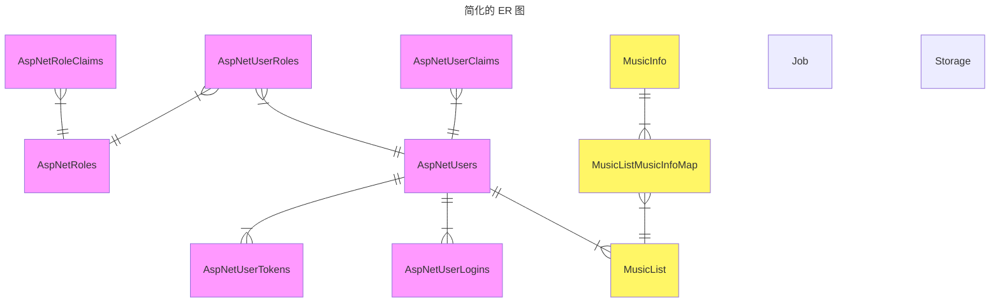

# 音乐管理项目开发文档

## DDD 建模
### 统一语言
* 管理员：管理系统的人。
* 用户：指听音乐的人。
* 存储：一个本地文件目录，系统将会扫描这个文件夹，更新音乐库的信息。
* 音乐信息：包括音乐标题、专辑名、歌手、文件位置、对应的存储。
* 歌单：每个用户有多个歌单，一个歌单有多个歌曲。

### 功能描述
* 管理员可以添加、删除、更新、查询存储信息。
* 管理员可以添加扫描存储任务，该任务可以扫描存储文件夹，更新音乐库的信息。
* 管理员可以取消任务。
* 用户可以注册和登录系统。只有登录的用户可以访问音乐库的信息。
* 用户可以添加、删除、更新、查询用户自己的歌单。
* 用户可以向歌单中添加音乐。
* 用户可以从歌单中删除音乐。
* 用户可以查询歌单中的音乐。
* 用户可以访问音乐库中所有的音乐信息；可以按关键词搜索音乐信息。
* 用户可以获取音乐的音频流。

### 聚合根
* 用户认证
    * ASP\.NET Identity 的 7 个实体。
* 音乐信息
    * 音乐信息实体
    * 用户歌单实体
* 音乐管理
    * 存储实体
    * 任务实体

### 领域事件
* 在音乐管理聚合根中，读取存储中的音乐文件的信息，通过领域事件，通知音乐信息聚合根，为音乐信息表添加或更新元组。

## 项目结构图

## 简化的 ER 图

## WebApi
### 管理员
#### 音乐管理
##### 添加存储

##### 删除存储

##### 更新存储

##### 查看所有存储

##### 创建任务

##### 查看所有任务

##### 取消任务

### 用户认证
#### 用户注册

#### 用户登录

#### 用户登出

### 主业务
#### 创建歌单

#### 删除歌单

#### 修改歌单

#### 查询所有歌单

#### 为歌单添加歌曲

#### 从歌单删除歌曲

#### 查询歌单的歌曲

#### 浏览所有歌曲（搜索歌曲）

#### 获取歌曲音频流
