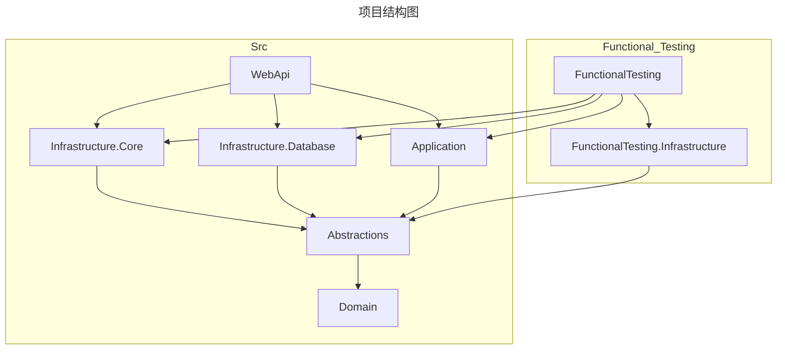
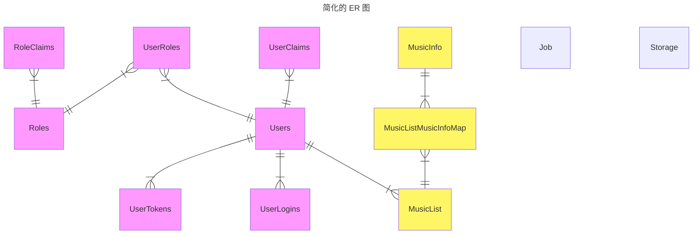

## 项目结构图

## 简化的 ER 图

## 技术方案
* .NET 9, CSharp 13
* 数据库： PostgresSQL 17
* ORM： EFCore
* 使用依赖注入，通过 Microsoft.Extensions.DependencyInjection 实现。
* 使用 [Injectio](https://github.com/loresoft/Injectio) 库，自动批量注册部分依赖。
* 使用中介者模式，通过 [Mediator](https://github.com/martinothamar/Mediator) 实现。
* 使用 Result 模式， 通过 [RustSharp](https://github.com/SlimeNull/RustSharp) 实现。
* 单元测试使用 xUnit v3.
