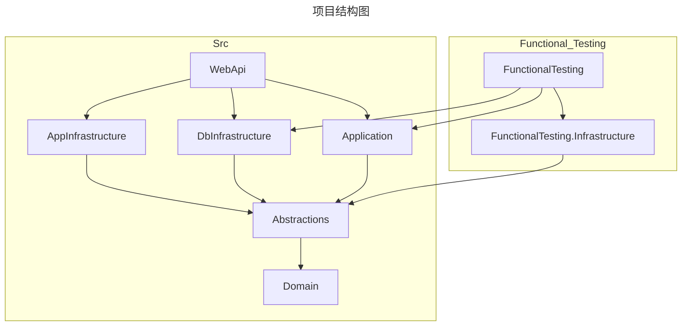
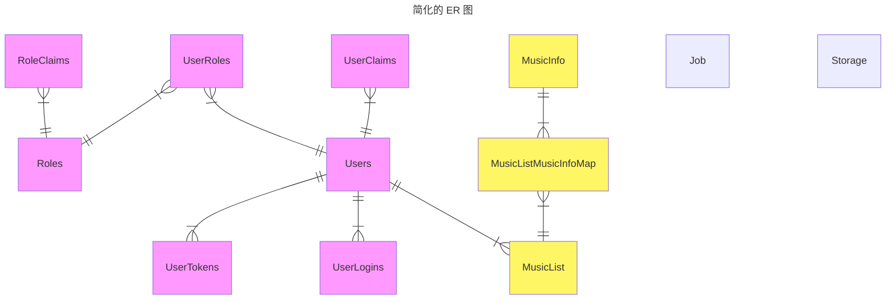

## 项目结构图

```mermaid
---
title: 项目结构图
---
flowchart TD
    subgraph Src
    WebApi --> AppInfrastructure
    WebApi --> DbInfrastructure
    WebApi --> Application
    AppInfrastructure --> Abstractions
    DbInfrastructure --> Abstractions
    Application --> Abstractions
    Abstractions --> Domain
    end

    subgraph Functional_Testing
    FunctionalTesting --> DbInfrastructure
    FunctionalTesting --> Application
    FunctionalTesting --> FunctionalTesting.Infrastructure
    FunctionalTesting.Infrastructure --> Abstractions
    end
```

## 简化的 ER 图

```mermaid
---
title: 简化的 ER 图
---
erDiagram
    UserRoles }|--|| Roles : ""
    RoleClaims }|--|| Roles : ""
    UserClaims }|--|| Users : ""
    Users ||--|{ UserTokens : ""
    UserRoles }|--|| Users : ""
    Users ||--|{ UserLogins : ""

    style UserRoles fill:#ff99ff
    style RoleClaims fill:#ff99ff
    style Roles fill:#ff99ff
    style UserClaims fill:#ff99ff
    style Users fill:#ff99ff
    style UserLogins fill:#ff99ff
    style UserTokens fill:#ff99ff

    Users ||--|{ MusicList : ""
    MusicListMusicInfoMap }|--|| MusicList : ""
    MusicInfo ||--|{ MusicListMusicInfoMap : ""

    style MusicListMusicInfoMap fill:#fff666
    style MusicList fill:#fff666
    style MusicInfo fill:#fff666

    Job
    Storage
```
