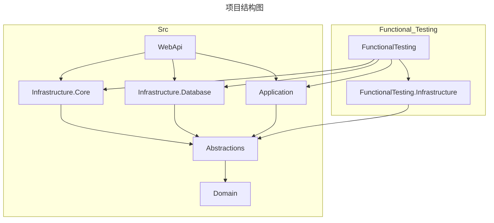
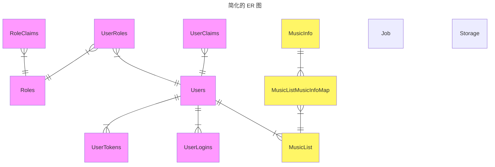

## 项目结构图

```mermaid
---
title: 项目结构图
---
flowchart TD
    subgraph Src
    WebApi --> Infrastructure.Core
    WebApi --> Infrastructure.Database
    WebApi --> Application
    Infrastructure.Core --> Abstractions
    Infrastructure.Database --> Abstractions
    Application --> Abstractions
    Abstractions --> Domain
    end

    subgraph Functional_Testing
    FunctionalTesting --> Infrastructure.Core
    FunctionalTesting --> Infrastructure.Database
    FunctionalTesting --> Application
    FunctionalTesting --> FunctionalTesting.Infrastructure
    FunctionalTesting.Infrastructure --> Abstractions
    end
```

把 Infrastructure, Application 分开，通过 Abstractions 中的接口调用。这样是利于单元测试的时候，以模块为单位进行替换。比如说，在对 Application 进行单元测试的时候，不需要访问实际的文件系统，弄一个虚拟的文件系统就行了。这基本是 FunctionalTesting.Infrastructure 做的事情。在启动的时候，根据是单元测试环境还是实际生产环境，调用对应项目的 `DependencyInjectionModule` 进行依赖注入，方便地替换模块。

## 简化的 ER 图

```mermaid
---
title: 简化的 ER 图
---
erDiagram
    UserRoles }|--|| Roles : ""
    RoleClaims }|--|| Roles : ""
    UserClaims }|--|| Users : ""
    Users ||--|{ UserTokens : ""
    UserRoles }|--|| Users : ""
    Users ||--|{ UserLogins : ""

    style UserRoles fill:#ff99ff
    style RoleClaims fill:#ff99ff
    style Roles fill:#ff99ff
    style UserClaims fill:#ff99ff
    style Users fill:#ff99ff
    style UserLogins fill:#ff99ff
    style UserTokens fill:#ff99ff

    Users ||--|{ MusicList : ""
    MusicListMusicInfoMap }|--|| MusicList : ""
    MusicInfo ||--|{ MusicListMusicInfoMap : ""

    style MusicListMusicInfoMap fill:#fff666
    style MusicList fill:#fff666
    style MusicInfo fill:#fff666

    Job
    Storage
```

## 技术方案

* .NET 10, CSharp 14
* 数据库： PostgresSQL 18
* ORM： EFCore
* 使用依赖注入，通过 Microsoft.Extensions.DependencyInjection 实现。
* 使用 [Injectio](https://github.com/loresoft/Injectio) 库，自动批量注册部分依赖。
* 使用中介者模式，通过 [Mediator](https://github.com/martinothamar/Mediator) 实现。
* 使用 Result 模式， 通过 [RustSharp](https://github.com/SlimeNull/RustSharp) 实现。
* 单元测试使用 xUnit v3.
